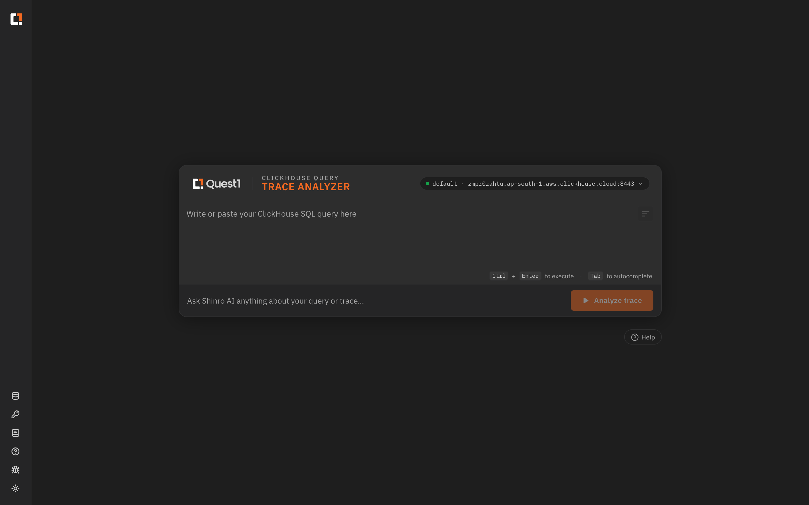
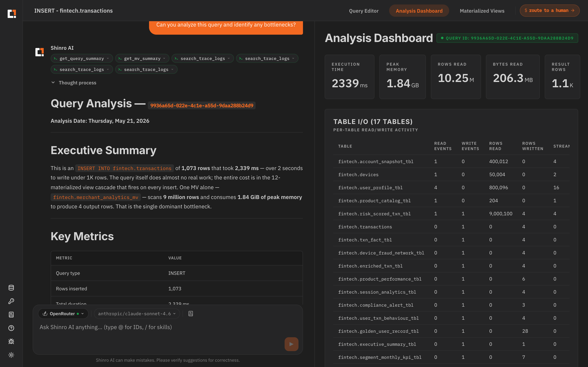
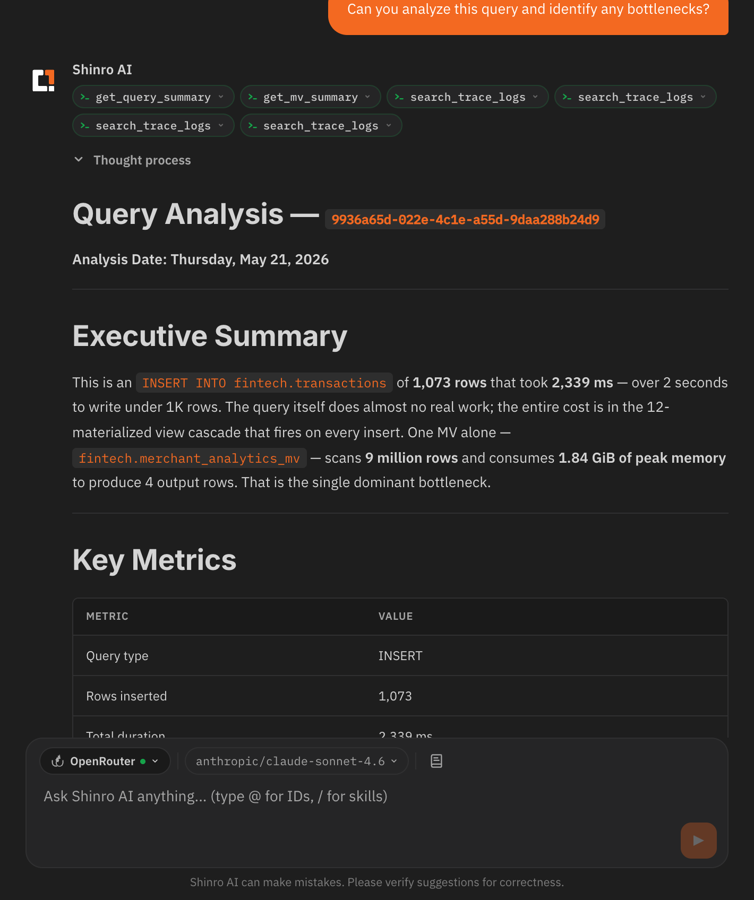
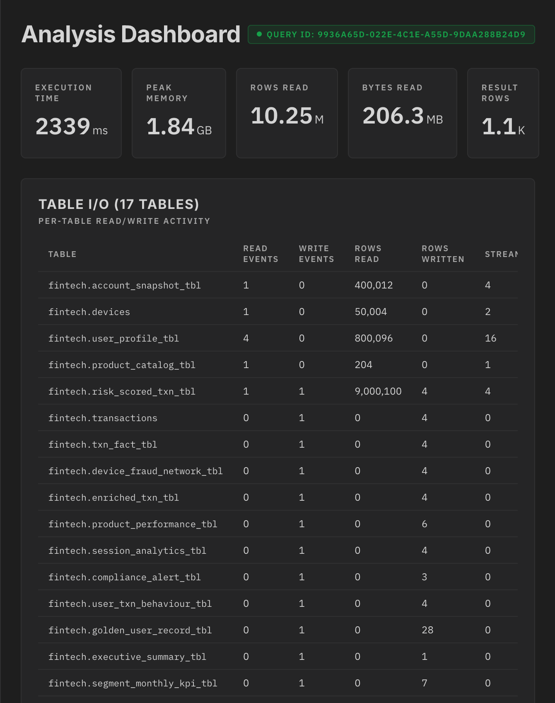
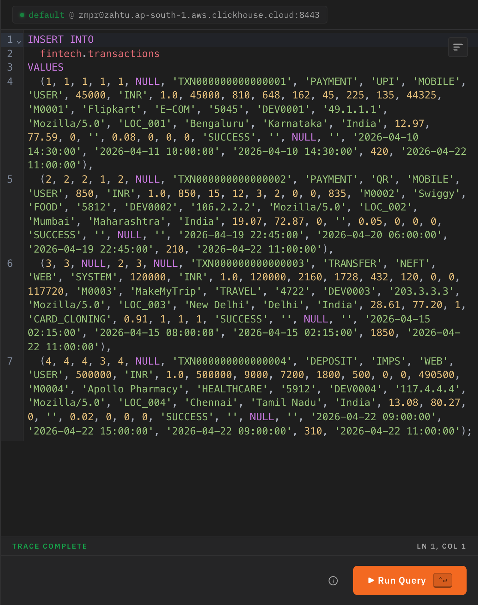
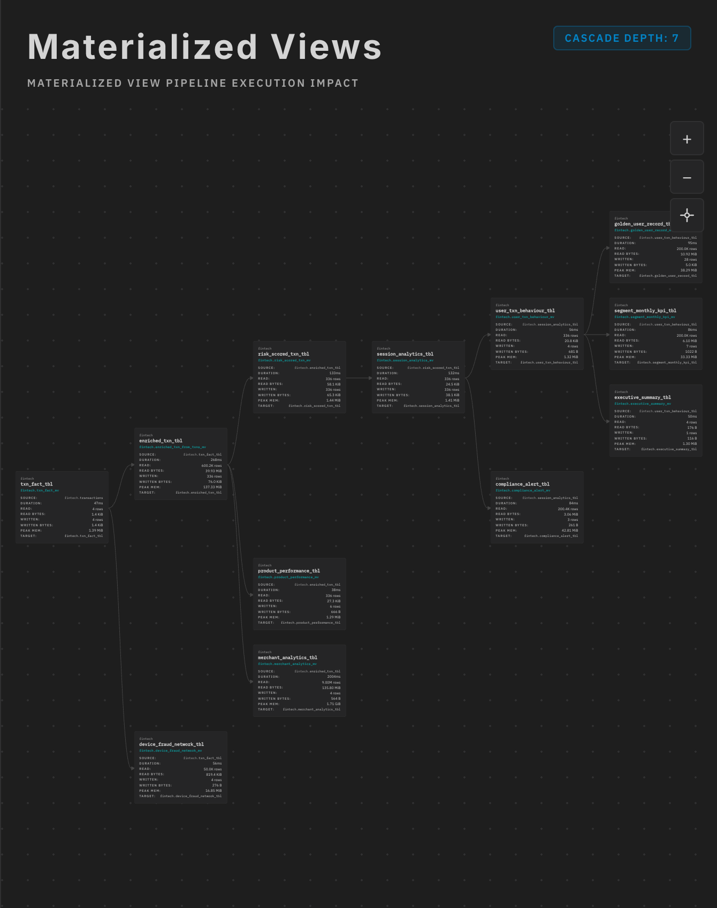

# Shinro Query Analyzer

Diagnose Clickhouse queries for bottlenecks and performance improvements. It automates retrieval of trace logs for a Clickhouse query, correlates it with data found in system tables, and presents it in a format suitable for analysis.

Also supports more dynamic analysis and natural-language conversations with an LLM of your choice .

Supported on macOS and Linux.

## Requirements
| Kind              | Supported                                                              |
|-------------------|------------------------------------------------------------------------|
| OS                | macOS **13** (Ventura)+ or Linux (`xdg-open` is optional and only used for automatic browser launch) |
| Clickhouse Server | Local and Cloud deployments - **v25, v26**                             |
| Query Types       | INSERT, SELECT                                                         |
| LLM Provider      | OpenAI, Anthropic, OpenRouter                                          |

## Quickstart

- Download the tool from the [Releases page](https://github.com/Quest1Codes/shinro-trace-analyzer/releases)
- Make the downloaded binary executable.
  ```shell
  chmod +x ./shinro-analyzer-<platform>-<arch>
  ```
- On macOS, if Gatekeeper blocks the app on first launch, remove the quarantine flag or approve execution from **Settings → Privacy & Security**.
  ```shell
  xattr -d com.apple.quarantine ./shinro-analyzer-macos-arm64
  ```
- The app opens, and a WebUI is available at [http://localhost:13000](http://localhost:13000) by default. On Linux, the app uses `xdg-open` when available; otherwise, open the printed URL manually.
- Credentials are stored locally. On macOS they use the system credential store; on Linux they use an encrypted local store under `~/.shinro/credentials/`.
- The port used by the app is configurable as follows.
  ```shell
  ./shinro-analyzer-<platform>-<arch> --port=13001
  ```

## Demo & Screenshots

<details>
<summary>Expand</summary>

### <u>Demo Video</u>

[](https://www.youtube.com/watch?v=gk4DKxoTR28)

[](https://www.youtube.com/watch?v=gk4DKxoTR28)

### <u>Screenshots</u>

**Terminal** — launch the analyzer from the command line; it starts a local web server on port 13000


**Query Editor** — paste or write a ClickHouse SQL query, optionally add context for Shinro AI, and hit Analyze trace



**Session Overview** — Shinro AI on the left, analysis dashboard on the right, switchable via the top tab bar



<table>
  <tr>
    <td align="center"><b>Shinro AI Analysis</b><br/>Tool calls, executive summary, and key metrics — plain-language diagnosis of where the time went<br/><br/></td>
    <td align="center"><b>Analysis Dashboard</b><br/>Execution time, peak memory, rows read, and a full per-table I/O breakdown across all 17 tables<br/><br/></td>
  </tr>
  <tr>
    <td align="center"><b>Query Editor Panel</b><br/>The traced query with syntax highlighting and one-click re-run<br/><br/></td>
    <td align="center"><b>Materialized Views</b><br/>Cascade-depth graph showing every MV triggered by the query and its individual cost<br/><br/></td>
  </tr>
</table>

</details>

## Build

- Prerequisite: Bun v1.3.13+. v1.3.12 has [a bug](https://github.com/oven-sh/bun/discussions/29151) that kills the built executable upon launch. Instructions on how to (re)install a specific version of Bun are [here](https://bun.com/docs/installation#installing-older-versions).
- Clone the repository, `cd` into the project directory.
- Run `bun install` to install dependencies.
- Run `bun build.ts` to build the frontend, and bundle the application into an executable. The built executable is present as `shinro-analyzer-macos-arm64`, `shinro-analyzer-macos-x86_64`, `shinro-analyzer-linux-arm64`, or `shinro-analyzer-linux-x86_64` in the same directory depending on the build host.

## Testing

The project includes a comprehensive unit test suite for backend components using Vitest.

### Running Tests

```bash
# Run all tests
bun run test

# Run tests with coverage report
bun run test:coverage

# Run tests in watch mode
bun run test:watch
```

### Test Coverage

- **Parser Logic**: 41 tests covering trace parsing, metadata extraction, table I/O stats, memory tracking, and materialized view analysis
- **Helpers and Platform Compatibility**: 29 tests covering file system operations, browser launch behavior, and cross-platform credential storage
- **Overall Coverage**: 90.68% statements, 82.63% branches, 87.23% functions, 91.19% lines

### Test Design

- Unit tests only (no integration tests)
- All dependencies mocked (ClickHouse, file system operations)
- Fast execution (~150ms for full test suite)
- TypeScript with ES module support

## License

Apache 2.0 — see [LICENSE](./LICENSE) for details.
