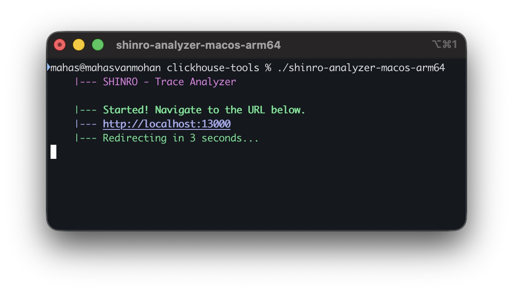
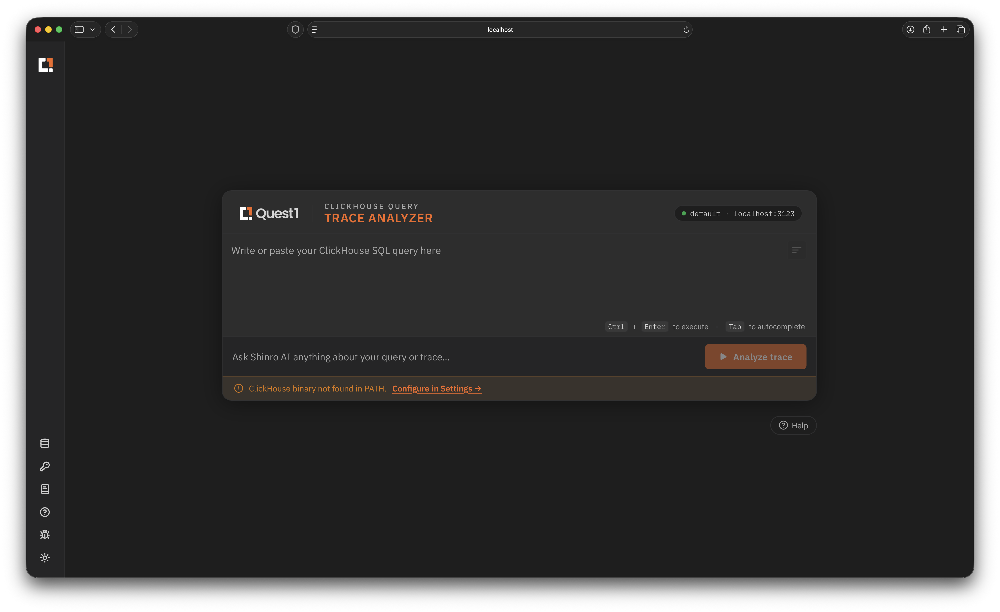

# Shinro Query Analyzer

Diagnose Clickhouse queries for bottlenecks and performance improvements. It automates retrieval of trace logs for a Clickhouse query, correlates it with data found in system tables, and presents it in a format suitable for analysis.

Also supports more dynamic analysis and natural-language conversations with an LLM of your choice .


## Requirements
| Kind              | Supported                                                              |
|-------------------|------------------------------------------------------------------------|
| OS                | macOS **13** (Ventura) and later, macOS **15** (Sequoia)+ recommended. |
| Clickhouse Server | Local and Cloud deployments - **v25, v26**                             |
| Query Types       | INSERT, SELECT                                                         |
| LLM Provider      | OpenAI, Anthropic, OpenRouter                                          |

## Quickstart

- Download the tool from the Releases page (todo: add link)
- Making the tool accessible can be done in two ways. You can either:
  1. Add execution permissions to the downloaded file.
      ```shell
      # Grant execute permission
      chmod +x shinro-analyzer-macos-arm64
      # Remove quarantine flag
      xattr -d com.apple.quarantine shinro-analyzer-macos-arm64
      ```
  2. Or, approve execution from Settings:
    - Double-click the executable to open it. If this is the first time of running, you will be shown a warning about potential privacy issues.
    - Click on **Done**.
    - Open Settings -> Privacy and Security -> Scroll down to find the entry for the tool, and click on **Open Anyway**. Follow the prompts.
- The app opens, and a WebUI is available at [http://localhost:13000](http://localhost:13000) by default.
- The port used by the app is configurable as follows.
  ```shell
  ./shinro-analyzer-macos-arm64 --port=13001
  ```

<details>
<summary>
    Screenshots
</summary>





</details>

## Build

- Prerequisite: Bun v1.3.13+. v1.3.12 has [a bug](https://github.com/oven-sh/bun/discussions/29151) that kills the built executable upon launch. Instructions on how to (re)install a specific version of Bun are [here](https://bun.com/docs/installation#installing-older-versions).
- Clone the repository, `cd` into the project directory.
- Run `bun install` to install dependencies.
- Run `bun build.ts` to build the frontend, and bundle the application into an executable. The built executable is present as `shinro-analyzer-macos-arm64` or `shinro-analyzer-macos-x86_64` in the same directory.
## License

(todo: fill)
